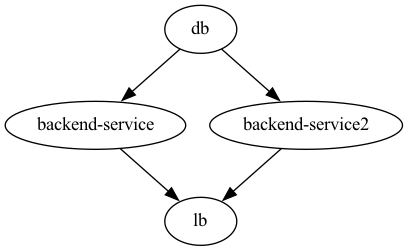

# Quick Start - Kubernetes on DigitalOcean 

This is a ready-to-use Torque Framework workspace used by [Quick Start Guide](https://docs.torque.cloud/quick-start). The workspace is a good foundation for developing a backend service and PostgreSQL database deployed on a Kubernetes cluster at DigitalOcean cloud provider. You can use Torque to build and deploy the workspace locally and on a cloud provider. As you'll see, all it takes to deploy the workspace are two Torque CLI commands.

The workspace has a few components best understood by looking at Architecture DAG (Directed Acyclic Graph). DAG has a load balancer, two backend API services, and a PostgreSQL database.



## Prerequisites

### 1. Software Setup

To run the DAG locally using Docker or to deploy it to DigitalOcean, you'll need to ensure you have these installed and up-to-date:

1. Git
2. Python 3.10+
3. pipx
4. Docker with Docker Compose
5. Torque CLI

For the installation details visit [Quick Start Guide - Runing Locally](https://docs.torque.cloud/quick-start/running-locally) or [Quick Start Guide - Deploying to DigitalOcean](https://docs.torque.cloud/quick-start/deploying-to-do).


### 2. DigitalOcean Account and Personal Access Token

To deploy the DAG to the DigitalOcean, you have to take care of a few things. The list includes:

1. You need a DigitalOcean account.
2. You need to obtain a DigitalOcean Personal Access Token with read and write scopes. The Personal Access Token will be used for the `DO_TOKEN` environment variable used by the Torque CLI.

For recommendations and instructions visit [Quick Start Guide - Deploying to DigitalOcean](https://docs.torque.cloud/quick-start/deploying-to-do).

## Run locally

This section provides overview of the steps required to run workspace locally. For detailed instructions visit: [Quick Start Guide - Runing Locally](https://docs.torque.cloud/quick-start/running-locally)

**⚠️ Important:**
Before proceeding to the deployment instructions make sure you have prerequisites satisfied. For the following commands to work, you need to have Docker installed and running on your laptop.

To build docker images for the two application services, we use:

```bash
torque deployment build local
```

Now, all we need to do is to `apply` the `local` deployment. The `apply` command for `local` first generates the `docker-compose.yaml` file and then executes the `docker compose` command.

```bash
torque deployment apply local
```

If you open the Docker dashboard, you will notice the `local-0wr4` deployment with five containers: lb (nginx), two backend services, one for the database, and one that initializes the database that should be exited after it runs and initializes the database. 

To check the running app execute the following:

```bash
curl -H "Host: api.example.com" http://localhost:8080/backend-service
```

The output should be the current database time. 

```bash
Database time: 2023-01-09T10:49:30.536818Z%
```

## Deployment to DigitalOcean

This section provides overview of the steps required to deploy workspace to DigitalOcean. For detailed instructions visit: [Quick Start Guide - Deploying to DigitalOcean](https://docs.torque.cloud/quick-start/deploying-to-do).

**⚠️ Important:**
Before proceeding to the deployment instructions make sure you have prerequisites satisfied. For the following commands to work, you need to have Docker installed and running on your laptop.

1. Set `DO_TOKEN` environment variable.

```bash
export DO_TOKEN=<dop_v1_replace_with_your_personal_access_token>
```

2. First we need to build `prod` deployment before applying it.

```bash
torque deployment build prod
```

3. Apply the `prod` deployment. 

```bash
torque deployment apply prod
```

The `apply` command will be waiting for all instances to be created on DigitalOcean and it might take up to half an hour until everything is up and running. But you do not need to worry about it, providers will do all the work. 

After the `apply` command finishes, you can visit your [DigitalOcean Dashboard](https://cloud.digitalocean.com/) to check created K8s cluster. DigitalOcean does a great job of explaining how to set up the `kubectl config` and use it to observe your K8s cluster. 
